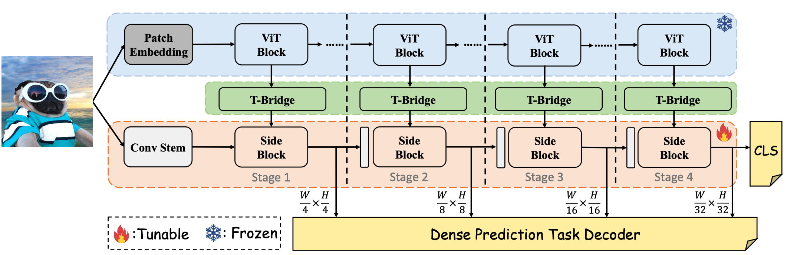

# Hierarchical Side-Tuning for Vision Transformers

This repo is the official implementation of our paper "Hierarchical Side-Tuning for Vision Transformers" ([arXiv](https://arxiv.org/abs/2310.05393)). 

**Weifeng Lin**, **Ziheng Wu**, **Wentao Yang**, **Mingxin Huang**, **Jun Huang** and **Lianwen Jin**


<div align="center">
    
</div>


## Usage

### Install

- Clone this repo:

```bash
git clone https://github.com/AFeng-x/HST.git
cd HST
```

- Create a conda virtual environment and activate it:

```bash
conda create -n HST python=3.8 -y
conda activate HST
```

- Install PyTorch:

```bash
pip3 install torch==1.10.1 torchvision==0.11.2 torchaudio --index-url https://download.pytorch.org/whl/cu113
```

- Install other requirements:

```bash
pip install -r requirements.txt
```


### Data preparation

- FGVC & vtab-1k

You can follow [VPT](https://github.com/KMnP/vpt) to download them. 

- VTAB-1K
  
Original download link: [vtab dataset](https://github.com/google-research/task_adaptation/tree/master/task_adaptation/data).

Following [SSF](https://github.com/dongzelian/SSF) to download the extracted vtab-1k dataset for convenience.

The license is in [vtab dataset](https://github.com/google-research/task_adaptation/tree/master/task_adaptation/data).


- CIFAR-100
```bash
wget https://www.cs.toronto.edu/~kriz/cifar-100-python.tar.gz
```


### Pre-trained model preparation

- For pre-trained ViT-B/16 or ViT-L/16 models on ImageNet-21K, the model weights will be automatically downloaded. You can also manually download them from [ViT](https://github.com/google-research/vision_transformer).

- For pre-trained ViT-B/16 on MAE, please download from [MAE](https://dl.fbaipublicfiles.com/mae/pretrain/mae_pretrain_vit_base.pth)


### Fine-tuning a pre-trained model via HST

To fine-tune a pre-trained ViT model via `HST`, pleasse refer to the [scripts](train_scripts). 
Examples:

```bash
bash train_scripts/vit/cifar_100/train_hsn_img21k.sh
```

### For Dense Prediction Tasks

You can directly transfer our [model](models/vit_hsn.py) in [mmdetection](https://github.com/open-mmlab/mmdetection) and [mmsegmentation](https://github.com/open-mmlab/mmsegmentation).


### Citation
If you find this project useful for your research and applications, please kindly cite our paper:
```
@article{lin2023hierarchical,
  title={Hierarchical side-tuning for vision transformers},
  author={Lin, Weifeng and Wu, Ziheng and Yang, Wentao and Huang, Mingxin and Huang, Jun and Jin, Lianwen},
  journal={arXiv preprint arXiv:2310.05393},
  year={2023}
}
```


### 💌 Acknowledgement
- [timm](https://github.com/rwightman/pytorch-image-models): the codebase we built upon.
- [VPT](https://github.com/KMnP/vpt) and [SSF](https://github.com/dongzelian/SSF): the codebase we refer to.
- [vtab github repo](https://github.com/google-research/task_adaptation/tree/master/task_adaptation/data): VTAB-1k


